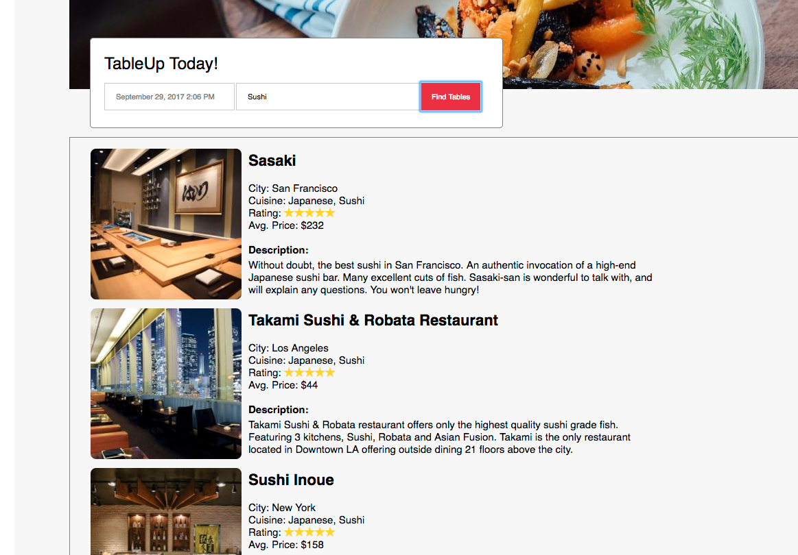
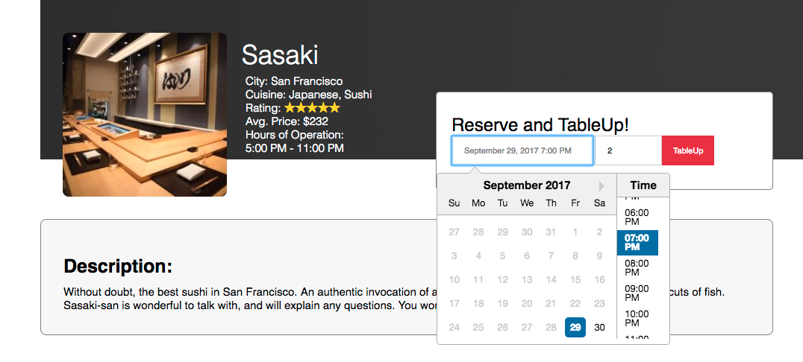

# TableUp
[Tableup Heroku Link](https://tableupfs.herokuapp.com/#/)

TableUp is a full-stack web app that helps you search for and make reservations at the all best restaurants. This app is inspired by OpenTable and is built with a Rails backend running PostgreSQL for the database. The front end is built out in the React.js/Redux framework.


## Features


### Search
TableUp has a simple search function that allows you to search by City, Cuisine type, or Restaurant name.
Implementing search in this way affords the user great ease in only having to interact with a single field.



The search logic was done in the Restaurant model. The main search by restaurant name method calls the search_by_city and search_by_cuisine methods to combine all the results.

```
def self.search_by_city(query)
  param = '%' + query.downcase + '%'
  Restaurant.where('lower(city) LIKE ?', param).limit(10)
end

def self.search_by_cuisine(query)
  param = '%' + query.downcase + '%'
  Restaurant.where('lower(cuisine) LIKE ?', param).limit(10)
end

def self.search_results(query)
  param = '%' + query.downcase + '%'
  by_name = Restaurant.where('lower(name) LIKE ?', param).limit(10)
  by_name + search_by_city(query) + search_by_cuisine(query)
end
```

### Reservations
Reservations can be made easily with the time and date calendar feature. The calendar is implemented with the [react-datepicker](https://github.com/Hacker0x01/react-datepicker) module. Users can quickly select both the date and time without having to move between fields. Just choose your party size and reserve!



### Additional resources
To see development and planning documentation
see the [wiki](https://github.com/ryan-mapa/tableup/wiki).

### Future planned features
+ Front page filtering by date/time user wants to reserve
+ Favorite status that a user can save for a restaurant
+ Protected routes so users can't view other user pages by url
+ Allow users to offer a rating on review that updates average on restaurant's rating
