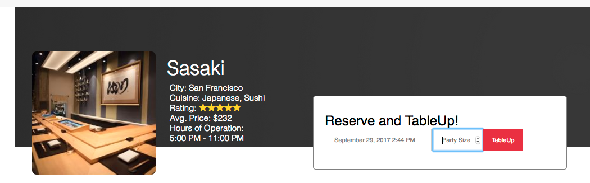

# TableUp

TableUp is a full-stack web app that helps you search for and make reservations at the all best restaurants. This app is inspired by OpenTable and is built with a Rails backend running PostgreSQL for the database. The front end is built out in the React.js/Redux framework.

## Features

### Search
SEARCH by city name/ restaurant or cuisine

### Reservations
make reservations  

###additional resources
see wiki: [wiki](https://github.com/ryan-mapa/tableup/wiki)

###Future planned features
+ Front page filtering by date/time user wants to reserve
+ Favorite status that a user can save for a restaurant
+ Protected routes so users can't view other user pages by url
+ Allow users to offer a rating on review that updates average on restaurant's rating
